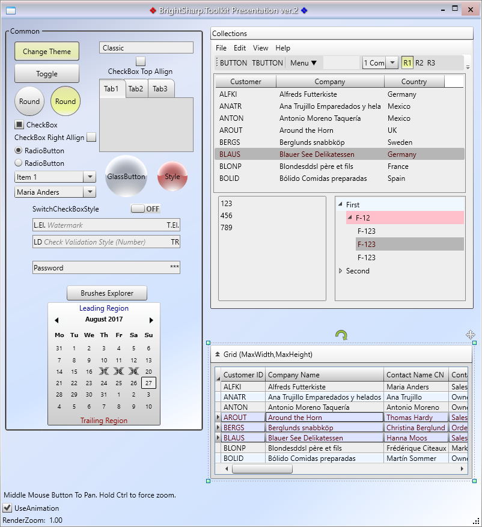
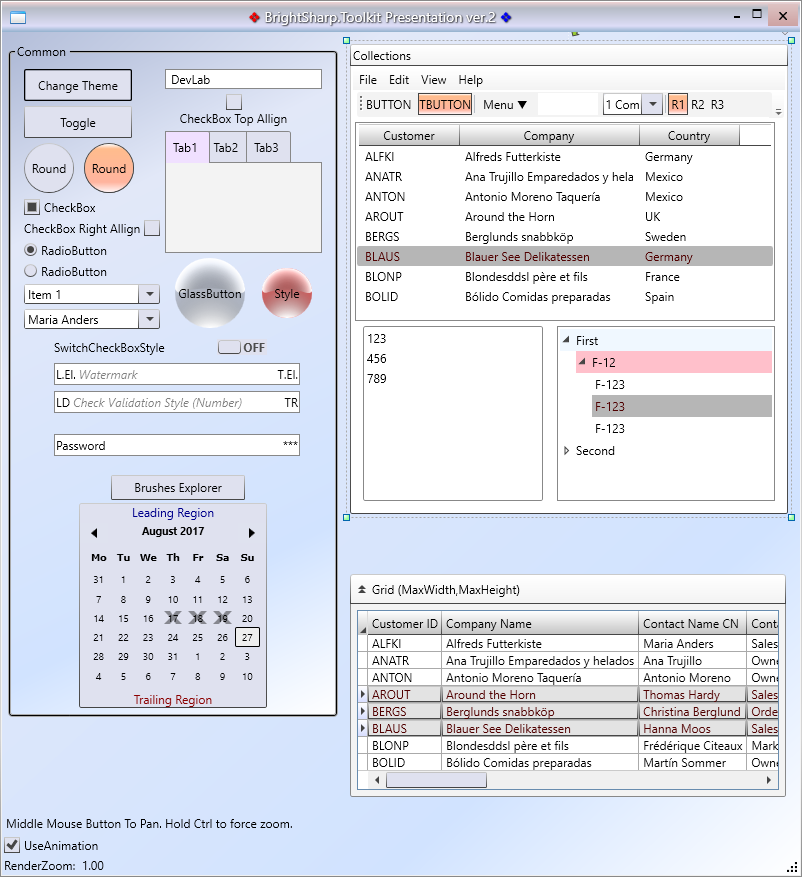
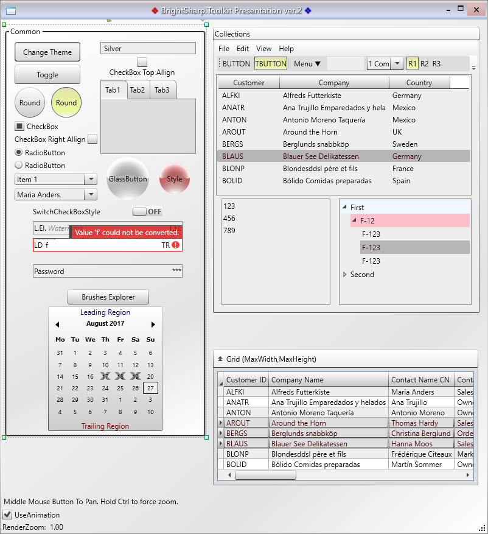
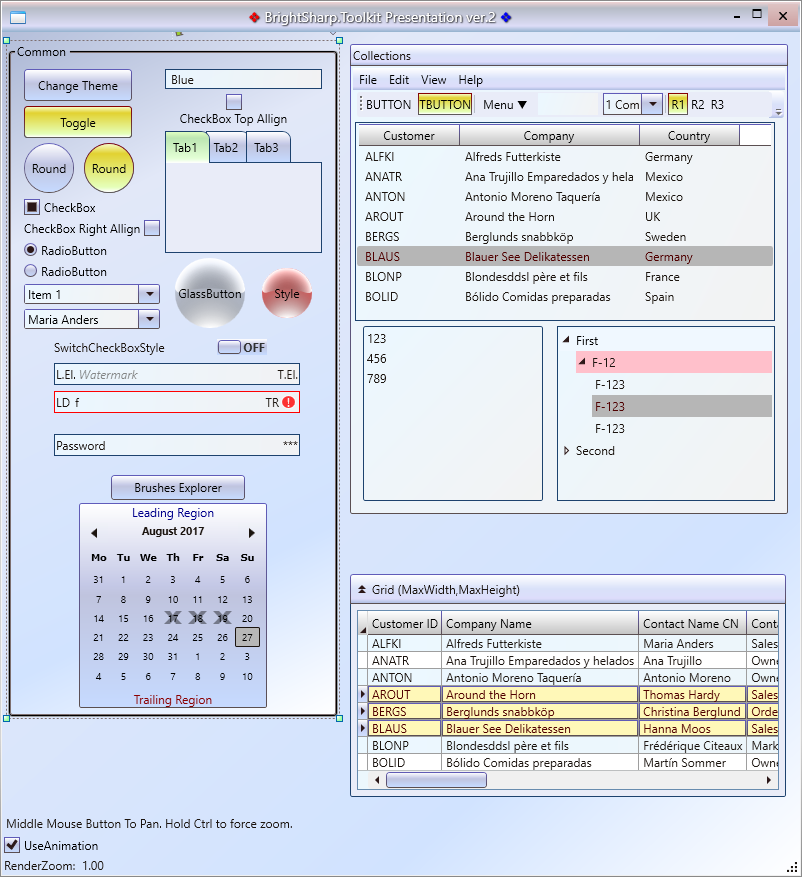
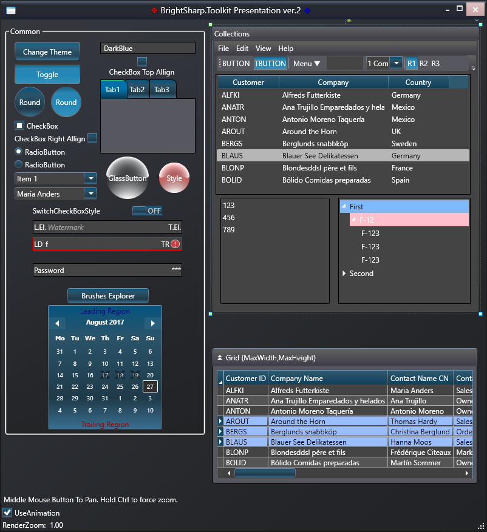

------------------------

# BrightSharp.Toolkit

Professional WPF Themes and User Controls. It requires `.NET 4.5`. 


### Current Version 2.1


### Nuget
```batch
 > Install-Package BrightSharp.Toolkit
```

## How To

1. [How to Apply Themes](docs/help/apply-themes.md)
2. [How to Use HtmlEditor](docs/help/htmleditor.md)
3. [Brushes List](docs/help/brushes.md)

## See presentation screenshots
Classic:



DevLab:



Silver:



Blue:



DarkBlue:



____________


#### Created by Vitaly.S (Minsk, Skype)