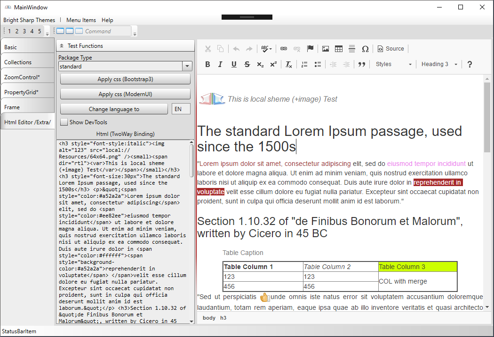

------------------------

# BrightSharp.Toolkit
## Free WPF Professional Themes and User Controls

### version 1.0.0


### Install **basic** from nuget package manager (requires .NET 4.0 AnyCPU)
```batch
 PM > Install-Package BrightSharp.Toolkit
```

### Install **extra** from nuget package manager (requires .NET 4.5.2 - x86 or x64)
```batch
 PM > Install-Package BrightSharp.Toolkit.Extra.64
```
NOTE: Extra controls use [CefSharp package](https://github.com/cefsharp/CefSharp) (x86 or x64 architecture required). 
In future we will add many different controls, that use HTML5 technologies. Extra package does not depend on basic.

## How To

1. [How to Apply Themes](docs/help/apply-themes.md)
3. [How to Use HtmlEditor](docs/help/htmleditor.md)

## Classic Theme


## HtmlEditor (CKEditor) Screenshot (Extra package)

