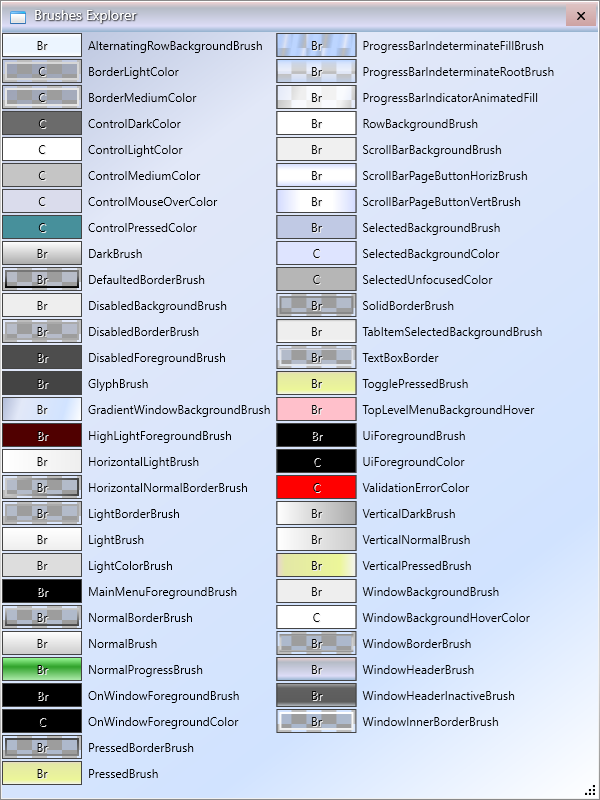

## Brushes List

## List of names

AlternatingRowBackgroundBrush 
BorderGapMaskConverter 
ButtonEllipseFocusVisual 
ButtonFocusVisual 
CalendarButtonStyle 
CalendarDayButtonStyle 
CalendarItemStyle 
CFocusVisual 
ComboBoxFocusVisual 
ComboBoxToggleButton 
DarkBrush 
DecoPasswordBoxContextMenu 
DecoTextBoxContextMenu 
DefaultedBorderBrush 
DefaultRadiusNormal 
DefaultRadiusSmall 
DevLabFrameStyle 
DisabledBackgroundBrush 
DisabledBorderBrush 
DisabledForegroundBrush 
ExpandCollapseToggleStyle 
ExpanderToggleButton 
Expandr2StyleGroupBox 
ExpandrStyleGroupBox 
FileItemStyle 
GlassButton 
GlyphBrush 
GridViewColumnHeaderGripper 
HighLightForegroundBrush 
HorizontalLightBrush 
HorizontalNormalBorderBrush 
HorizontalScrollBar 
HorizontalSlider 
JournalEntryUnifiedViewConverter 
LightBorderBrush 
LightBrush 
LightColorBrush 
MainMenuForegroundBrush 
NormalBorderBrush 
NormalBrush 
NormalProgressBrush 
OnWindowForegroundBrush 
OptionMarkFocusVisualBottom 
OptionMarkFocusVisualLeft 
OptionMarkFocusVisualRight 
OptionMarkFocusVisualTop 
OptionRadioButtonStyle 
PressedBorderBrush 
PressedBrush 
ProgressBarIndeterminateFillBrush 
ProgressBarIndeterminateRootBrush 
ProgressBarIndicatorAnimatedFill 
RadioButtonFocusVisual 
RoundedTabItemStyle 
RowBackgroundBrush 
ScrollBarBackgroundBrush 
ScrollBarLineButton 
ScrollBarPageButtonHoriz 
ScrollBarPageButtonHorizBrush 
ScrollBarPageButtonVert 
ScrollBarPageButtonVertBrush 
ScrollBarThumb 
SelectedBackgroundBrush 
SliderButtonStyle 
SliderThumbStyle 
SliderThumbStyleDirected 
SliderThumbStyleDirectedHor 
SolidBorderBrush 
SubMenuItemRadioButtonTemplate 
SwitchButtonFocusVisual 
SwitchCheckBoxStyle 
SynWindowBackgroundBrush 
TabItemRadius 
TabItemSelectedBackgroundBrush 
TabRadiusBottom 
TabRadiusLeft 
TabRadiusRight 
TabRadiusTop 
TestWindowStyle 
TextBoxBorder 
ThickConv 
TogglePressedBrush 
TopLevelMenuBackgroundHover 
UiForegroundBrush 
VerticalDarkBrush 
VerticalNormalBrush 
VerticalPressedBrush 
VerticalScrollBar 
VerticalScrollBarThumb 
VerticalSlider 
WindowBackgroundBrush 
WindowSolidBrush 
ControlDarkColor 
ControlLightColor 
ControlMediumColor 
ControlMouseOverColor 
ControlPressedColor 
OnWindowForegroundColor 
SelectedBackgroundColor 
SelectedUnfocusedColor 
UiForegroundColor 
ValidationErrorColor 
WindowBackgroundHoverColor 
